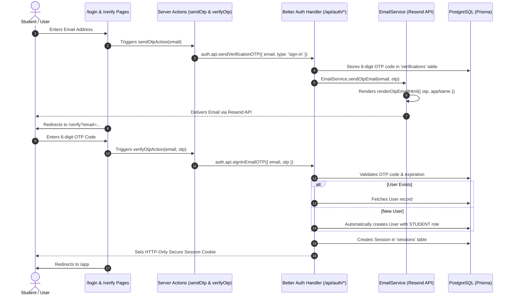

# Authentication Architecture & Better Auth / Resend Email Specification

## Overview

Campus Minutes implements a **Passwordless Email OTP** authentication system powered by **Better Auth** with a **Prisma PostgreSQL Adapter**, backed by **Resend** for production transactional email delivery.

There are **no passwords** and **no signup forms**. Authentication automatically authenticates existing users or creates a new user record upon first successful OTP verification.

---

## Environment Variables Configuration

The following environment variables are strictly validated via `@t3-oss/env-nextjs` in [`src/env.ts`](file:///d:/All%20Projects/CampusMinutes/src/env.ts):

| Variable              | Description                                     | Example / Default                             |
| --------------------- | ----------------------------------------------- | --------------------------------------------- |
| `RESEND_API_KEY`      | Resend API Key for transactional emails         | `re_123456789_example`                        |
| `FROM_EMAIL`          | Sender email address with brand display name    | `Campus Minutes <auth@campusminutes.com>`     |
| `APP_NAME`            | Application brand name                          | `Campus Minutes`                              |
| `NEXT_PUBLIC_APP_URL` | Public application URL                          | `http://localhost:3000`                       |
| `AUTH_SECRET`         | Secret key for session encryption & JWT signing | `development_secret_key_change_in_production` |

---

## Production Email Delivery Flow (Resend)

---

## OTP Lifecycle & Business Rules

- **OTP Length**: Exactly 6 digits (`000000` – `999999`).
- **OTP Expiration**: 10 minutes (`expiresIn: 600` seconds).
- **Resend Cooldown**: 60 seconds enforced on client & server (`AUTH_CONSTANTS.RESEND_COOLDOWN_SECONDS`).
- **Maximum Attempts**: 5 invalid attempts allowed per verification cycle before requiring a new OTP code.

---

## Error Handling & Security Policies

1. **Email Input Validation**: Normalized to lowercase and validated via Zod (`emailSchema`).
2. **Delivery Failures**: Caught gracefully by `EmailService.sendOtpEmail()` and logged to server error output without exposing internal API keys or OTP codes in production logs.
3. **Expired & Invalid OTP**: User-friendly error messages returned via Server Actions to the UI.
4. **Logging Policy**:
   - **Development**: Log delivery status and message IDs.
   - **Production**: **NEVER** log OTP codes. Log delivery failures only.

---

## Service Layer & Modular Structure

- **Email Service**: [`src/features/auth/services/email.service.ts`](file:///d:/All%20Projects/CampusMinutes/src/features/auth/services/email.service.ts)
  Handles Resend API calls and fallback modes.
- **Email Template**: [`src/lib/email/otp-template.ts`](file:///d:/All%20Projects/CampusMinutes/src/lib/email/otp-template.ts)
  Generates responsive HTML emails with Campus Minutes branding, greeting, OTP code block, 10-minute expiry warning, and security notice.
- **Better Auth Integration**: [`src/lib/auth/auth.ts`](file:///d:/All%20Projects/CampusMinutes/src/lib/auth/auth.ts)
  Hooks `EmailService.sendOtpEmail` directly into the `sendVerificationOTP` plugin callback.
