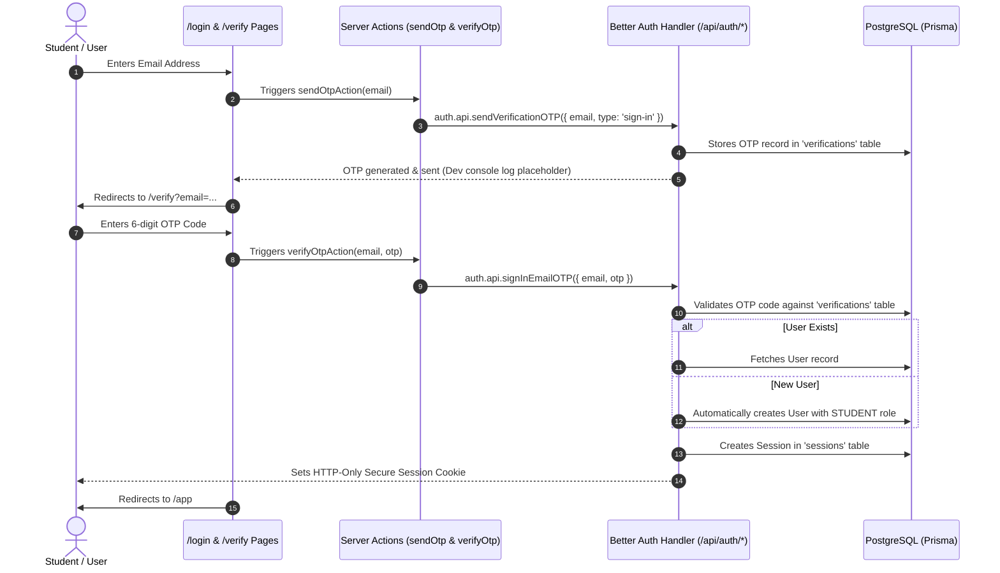

# Authentication Architecture & Better Auth Specification

## Overview

Campus Minutes implements a **Passwordless Email OTP** authentication system powered by **Better Auth** and integrated with **Prisma ORM** on PostgreSQL.

There are **no passwords** and **no signup forms**. Authentication automatically authenticates existing users or creates a new user record upon first successful OTP verification.

---

## Complete Authentication Flow



---

## Session Architecture & Security Policies

1. **Prisma Database Adapter**:
   Session states are persisted in PostgreSQL via Prisma (`sessions`, `accounts`, `verifications` tables).

2. **HTTP-Only Cookie Storage**:
   Session tokens are stored exclusively in HTTP-only, `SameSite=Lax` cookies, preventing client-side XSS token theft.

3. **Session Lifetime & Rotation**:
   - **Expiration**: 7 days (`expiresIn: 60 * 60 * 24 * 7`).
   - **Rotation / Update Age**: 1 day (`updateAge: 60 * 60 * 24`).
   - **Cache**: 5 minutes cookie caching enabled.

4. **CSRF & Email Validation**:
   - All email inputs are validated and normalized to lowercase via Zod (`emailSchema`).
   - Anti-CSRF protection enforced on all state-changing auth endpoints.

---

## Better Auth Configuration Setup

- **Server Instance**: [`src/lib/auth/auth.ts`](file:///d:/All%20Projects/CampusMinutes/src/lib/auth/auth.ts)
  Configured with `prismaAdapter(prisma)`, `emailOTP` plugin, disabled password logins, and dev console OTP logging (Sprint 2.3 placeholder for Resend).
- **Client Instance**: [`src/lib/auth/auth-client.ts`](file:///d:/All%20Projects/CampusMinutes/src/lib/auth/auth-client.ts)
  Configured with `createAuthClient` and `emailOTPClient()`.
- **API Handler**: [`src/app/api/auth/[...all]/route.ts`](file:///d:/All%20Projects/CampusMinutes/src/app/api/auth/%5B...all%5D/route.ts)
  Exposes `GET` and `POST` routes via `toNextJsHandler(auth.handler)`.

---

## Feature Folder Structure (`src/features/auth/`)

```
src/features/auth/
├── actions/
│   ├── send-otp.action.ts      # Server Action to request OTP code
│   ├── verify-otp.action.ts    # Server Action to verify OTP & authenticate
│   └── index.ts
├── components/
│   ├── LoginForm.tsx           # Email entry UI component
│   ├── VerifyForm.tsx          # 6-digit OTP verification UI component
│   └── index.ts
├── constants/
│   ├── auth.constants.ts       # OTP expiry & route constants
│   └── index.ts
├── hooks/
│   ├── use-auth.ts             # Custom React hook for auth state & cooldowns
│   └── index.ts
├── schemas/
│   ├── auth.schema.ts          # Zod validation schemas for Email & OTP
│   └── index.ts
├── services/
│   ├── auth.service.ts         # Server-side session verification service
│   └── index.ts
├── types/
│   ├── auth.types.ts           # Auth user & payload interfaces
│   └── index.ts
└── index.ts                    # Public API surface export
```

---

## Routes & Navigation Targets

- **`/login`**: Email address entry page.
- **`/verify`**: OTP code entry page.
- **`/app`**: Authenticated dashboard target route after successful login.
