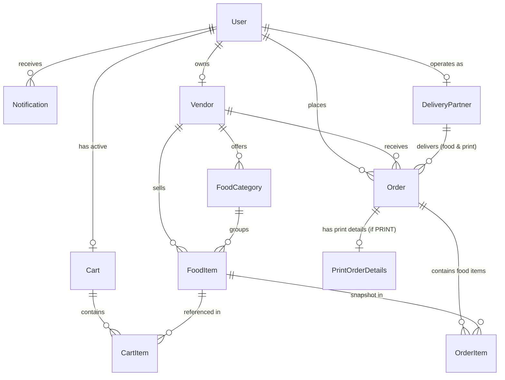

# Campus Minutes — Database Architecture & Schema Documentation

## Overview

Campus Minutes uses **PostgreSQL** hosted on **Neon** managed via **Prisma ORM**. The database is fully normalized, scalable, and built around a **Unified Order Architecture**. Every transaction—whether canteen food ordering or Xerox document printing—is represented as an `Order` with a single unified lifecycle, UUID primary keys, soft deletion, and composite index optimization.

---

## Why the Unified Order Architecture is Superior

1. **Single-Table Chronological Order History**:
   A student's order history can be retrieved in a single, index-backed query (`WHERE userId = ? ORDER BY createdAt DESC`) using the composite index `[userId, createdAt]`. This avoids expensive SQL `UNION` queries and complex client-side sorting across separate `Order` and `PrintOrder` tables.

2. **Simplified & High-Performance Analytics**:
   Vendor, Admin, and Delivery Partner dashboards can compute metrics (Total Revenue, Total Order Count, Pending Orders, Completed Orders) via standard SQL aggregations (`SUM(total)`, `COUNT(*)`) against the unified `orders` table, filtered by `vendorId`, `status`, or `type`.

3. **Unified Order Status Lifecycle**:
   Both food and print orders follow the identical status state-machine (`PLACED` → `CONFIRMED` → `PREPARING` → `READY_FOR_PICKUP` → `OUT_FOR_DELIVERY` → `DELIVERED` | `CANCELLED`). This simplifies WebSocket real-time updates, event listeners, and push notification handlers across the codebase.

4. **Normalized 1-to-1 Extension Pattern**:
   Common transaction fields (`status`, `total`, `deliveryLocation`, `deliveryInstructions`, `vendorId`, `deliveryPartnerId`, timestamps) reside strictly on `Order`. Specialized print attributes (`pdfUrl`, `pages`, `copies`, `colorMode`, `paperSize`, `binding`) reside in a normalized 1-to-1 extension table (`PrintOrderDetails`), ensuring zero field duplication or null-column clutter.

---

## Entity-Relationship Diagram (ERD)

---

## Model Specifications

### 1. `User` (`users`)

Represents students, canteen vendors, delivery partners, and system administrators.

- **Fields**: `id`, `name`, `email` (unique), `image`, `role` (`UserRole`), `createdAt`, `updatedAt`, `deletedAt`.
- **Authentication**: Passwordless Email OTP authentication.
- **Role Hierarchy**: `STUDENT`, `VENDOR`, `DELIVERY_PARTNER`, `ADMIN`.

### 2. `Vendor` (`vendors`)

Represents campus vendors (BCC Canteen, Meta Canteen, Xerox Store).

- **Fields**: `id`, `name`, `description`, `type` (`VendorType`: `CANTEEN` | `XEROX`), `status` (`VendorStatus`: `OPEN`, `CLOSED`, `BUSY`, `INACTIVE`), `acceptingOrders` (`Boolean` default `true`), `ownerId` (User foreign key), `createdAt`, `updatedAt`, `deletedAt`.
- **Operational Controls**: `status` controls overall opening status, while `acceptingOrders` allows vendors to temporarily pause incoming orders during peak rush hours without closing the shop.

### 3. `FoodCategory` (`food_categories`)

Groups food menu items under vendors (e.g., Meals, Snacks, Drinks, Desserts).

- **Fields**: `id`, `vendorId`, `name`, `description`, `createdAt`, `updatedAt`, `deletedAt`.
- **Constraints**: Unique constraint on `[vendorId, name]`.

### 4. `FoodItem` (`food_items`)

Individual vegetarian menu items offered by canteen vendors.

- **Fields**: `id`, `vendorId`, `categoryId`, `name`, `description`, `price` (`Decimal`), `image`, `available` (`Boolean`), `preparationTime` (minutes), `createdAt`, `updatedAt`, `deletedAt`.
- **Dietary Policy**: Campus Minutes serves 100% vegetarian food; no `veg` / `non-veg` flags exist.

### 5. `Cart` (`carts`) & `CartItem` (`cart_items`)

Transient shopping cart per user.

- **Cart Fields**: `id`, `userId` (unique), `createdAt`, `updatedAt`.
- **CartItem Fields**: `id`, `cartId`, `foodItemId`, `quantity`, `price` (snapshot price), `createdAt`, `updatedAt`.
- **Constraints**: Unique constraint on `[cartId, foodItemId]`.

### 6. `Order` (`orders`)

Unified transactional model for both Food and Print orders.

- **Fields**: `id`, `type` (`OrderType`: `FOOD` | `PRINT`), `userId`, `vendorId`, `deliveryPartnerId` (optional), `status` (`OrderStatus`), `total` (`Decimal`), `deliveryLocation`, `deliveryInstructions`, `estimatedReadyTime`, `estimatedDeliveryTime`, `createdAt`, `updatedAt`, `deletedAt`.
- **Relations**:
  - `items`: `OrderItem[]` (One-to-Many for `FOOD` orders).
  - `printOrderDetails`: `PrintOrderDetails?` (One-to-One for `PRINT` orders).
  - `deliveryPartner`: `DeliveryPartner?` (handles both food and print deliveries).

### 7. `OrderItem` (`order_items`)

Line items for food orders containing historical price snapshots.

- **Fields**: `id`, `orderId`, `foodItemId`, `quantity`, `price` (`Decimal`), `createdAt`, `updatedAt`.

### 8. `PrintOrderDetails` (`print_order_details`)

1-to-1 extension model for Xerox document printing parameters.

- **Fields**: `id`, `orderId` (unique foreign key), `pdfUrl`, `pages`, `copies`, `colorMode` (`BLACK_AND_WHITE` | `COLOR`), `paperSize` (`A4` | `A3` | `A5` | `LETTER` | `LEGAL`), `binding` (`NONE` | `STAPLE` | `SPIRAL` | `HARD_BOUND`), `createdAt`, `updatedAt`.

### 9. `DeliveryPartner` (`delivery_partners`)

Campus student/staff delivery partners.

- **Fields**: `id`, `userId` (optional link), `name`, `phone`, `status` (`DeliveryPartnerStatus`: `AVAILABLE`, `BUSY`, `OFFLINE`), `rating`, `completedDeliveries`, `createdAt`, `updatedAt`, `deletedAt`.

### 10. `Notification` (`notifications`)

In-app user alert notifications.

- **Fields**: `id`, `userId`, `title`, `body`, `actionUrl` (optional deep-link), `readAt` (`DateTime?`), `type` (`NotificationType`), `createdAt`, `updatedAt`.

---

## Indexing Strategy & Performance Justifications

1. **Composite Index `[userId, createdAt]` on `orders`**:
   - Accelerates fetching student order history (`SELECT * FROM orders WHERE userId = ? ORDER BY createdAt DESC`) in a single index scan without sorting overhead or `UNION` queries.

2. **Composite Index `[vendorId, status]` on `orders`**:
   - Powers real-time vendor management dashboards filtering incoming active orders (`WHERE vendorId = ? AND status = 'PLACED'`).

3. **Single Foreign Key Indexes**:
   - `orders(userId)`, `orders(vendorId)`, `orders(deliveryPartnerId)`, `orders(type)`, `orders(status)`
   - `food_items(vendorId)`, `food_items(categoryId)`, `food_items(available)`
   - `cart_items(cartId)`, `cart_items(foodItemId)`
   - `notifications(userId)`, `notifications(readAt)`

4. **Soft Delete Filtering (`deletedAt`)**:
   - Indexing `deletedAt` across `users`, `vendors`, `food_items`, `orders`, and `delivery_partners` ensures soft-deleted filtering (`deletedAt IS NULL`) executes via index bitmap scans.
